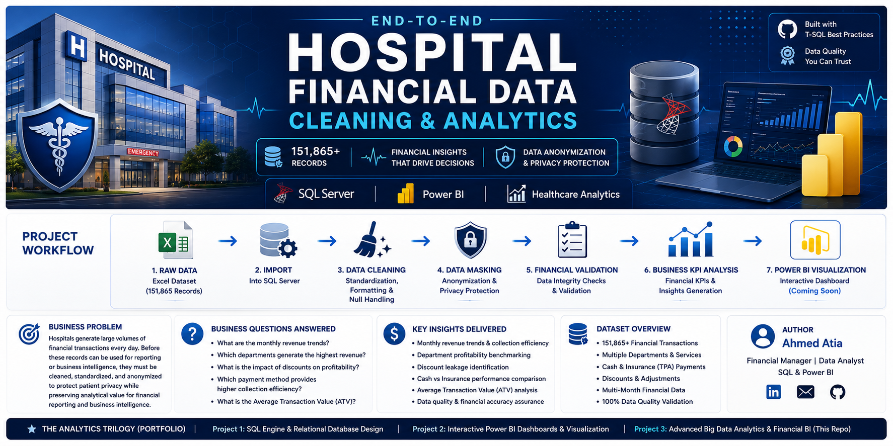

  

# 🏥 End-to-End Hospital Financial Data Cleaning & Analytics (151K+ Records)

## 🎯 Project Vision
This is the **third and most advanced installment** in the Hospital Analytics series. While the first two projects focused on relational design and basic visualization, this project tackles **Large Healthcare Financial Dataset (151K+ Records)**. Processing over **151,000+ medical records**, it focuses on advanced financial auditing, data security (Anonymization), and high-precision reporting using T-SQL.

---

## 🚀 Technical Achievements & Insights

### 2. Monthly Revenue Trends

Generated monthly financial reports covering **151,865 transactions** to analyze revenue trends and collection efficiency.

*(Screenshot: T-SQL execution ensuring 100% data integrity across 151,865 rows)*

### 3. Service Line Profitability & Discount Audit
Benchmarking department performance (ER, Clinic, Lab, etc.) and auditing **Discount Leakages**. This helps management identify which services provide the highest ROI.

*(Screenshot: Profitability analysis and discount percentage per department)*

### 4. Payment Method & Collection Efficiency

Compared Cash vs Insurance transactions to evaluate collection efficiency and Average Transaction Value (ATV).

*(Screenshot: Audit of Cash vs. Insurance transaction volume and value)*

---

## 🛠️ Tech Stack & SQL Mastery

- Microsoft SQL Server
- T-SQL
- Common Table Expressions (CTEs)
- CASE WHEN
- Aggregations
- Data Cleaning
- Data Masking
- Financial Analytics
- 
## Business Problem
Hospitals generate large volumes of financial transactions every day. Before these records can be used for reporting or business intelligence, they must be cleaned, standardized, and anonymized to protect patient privacy while preserving analytical value for financial reporting and business intelligence.

## Architecture

Excel Dataset (151,865 Records)

↓

SQL Server

↓

Data Cleaning & Anonymization

↓

Financial Validation

↓

Business KPIs

↓

Interactive Power BI Dashboard (Coming Soon)

## Workflow

Raw Excel File

↓

Import into SQL Server

↓

Data Cleaning

↓

Data Masking

↓

Financial Validation

↓

Business KPI Analysis

↓

Power BI Visualization

## Business Questions Answered
- What are the monthly revenue trends?

- Which departments generate the highest revenue?

- What is the impact of discounts on profitability?

- Which payment method provides higher collection efficiency?

- What is the Average Transaction Value (ATV)?

## 🔗 The Analytics Trilogy (Portfolio)
* **[Project 1]:** SQL Engine & Relational Database Design.
* **[Project 2]:** Interactive Power BI Dashboards & Visualization.
* **[Project 3]:** Advanced Big Data Analytics & Financial BI (This Repo).

---
## 👷 Author
**Ahmed Atia** *Financial Manager | Data Analyst | SQL & Power BI*
